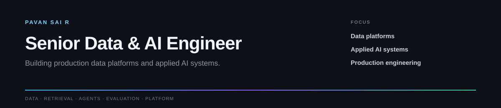
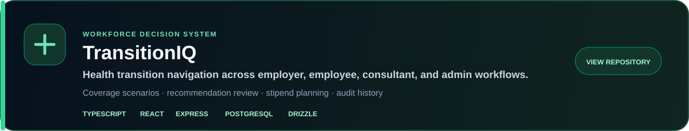
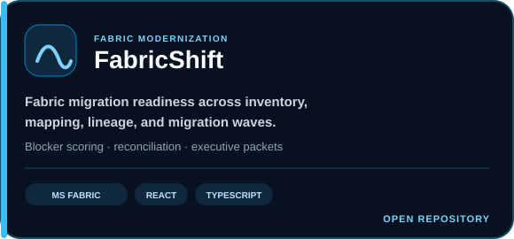
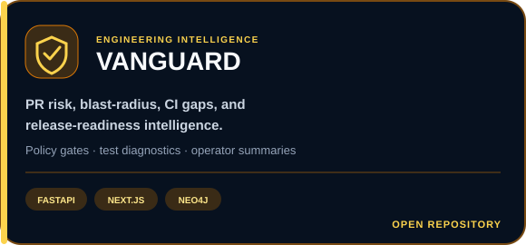
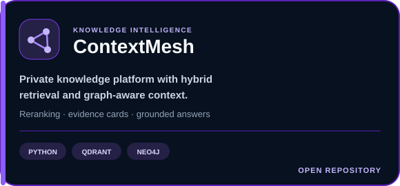
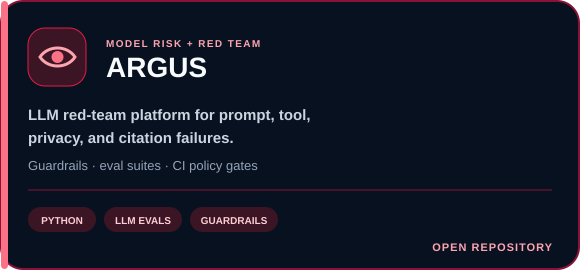
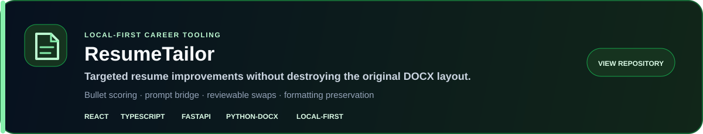
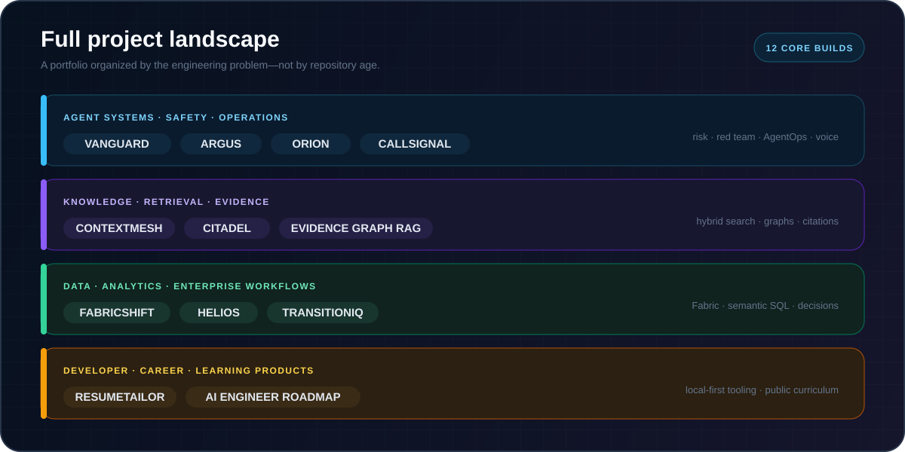
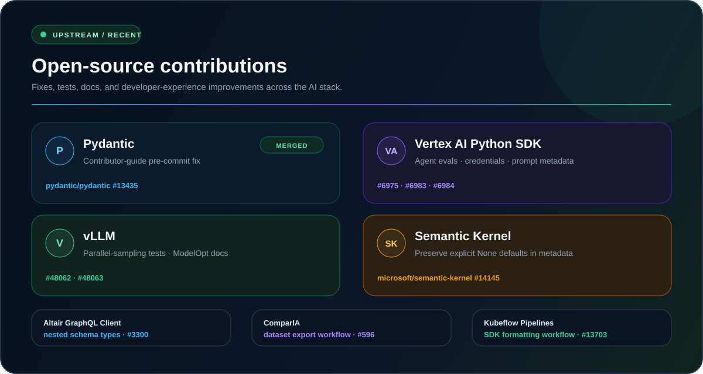

<picture>
  <source media="(prefers-color-scheme: dark)" srcset="./assets/banner.svg">
  <source media="(prefers-color-scheme: light)" srcset="./assets/banner-light.svg">
  
</picture>

  
  
  
  

 

<h2 align="center">Selected work</h2>

Six production-minded systems spanning enterprise workflows, retrieval, model risk, and developer experience.

  
  

  
  

  
  

 

  
<strong>Direct repository index</strong>

   

  **Agent systems:** [VANGUARD](https://github.com/PSR94/VANGUARD) · [ARGUS](https://github.com/PSR94/ARGUS) · [ORION](https://github.com/PSR94/ORION) · [CALLSIGNAL](https://github.com/PSR94/CALLSIGNAL)

  **Knowledge:** [ContextMesh](https://github.com/PSR94/ContextMesh) · [CITADEL](https://github.com/PSR94/citadel) · [Evidence Graph RAG](https://github.com/PSR94/knowledge_graph_rag)

  **Data and enterprise:** [FabricShift](https://github.com/PSR94/fabricshift) · [HELIOS](https://github.com/PSR94/helios) · [TransitionIQ](https://github.com/PSR94/TransitionIQ)

  **Developer products:** [ResumeTailor](https://github.com/PSR94/resume-tailor) · [AI Engineer Roadmap 2026](https://psr94.github.io/ai-engineer-roadmap-custom/)

 

  
<strong>Direct pull-request index</strong>

   

  - **Pydantic:** [#13435](https://github.com/pydantic/pydantic/pull/13435) — merged contributor-guide fix
  - **Vertex AI Python SDK:** [#6975](https://github.com/googleapis/python-aiplatform/pull/6975) · [#6983](https://github.com/googleapis/python-aiplatform/pull/6983) · [#6984](https://github.com/googleapis/python-aiplatform/pull/6984)
  - **vLLM:** [#48062](https://github.com/vllm-project/vllm/pull/48062) · [#48063](https://github.com/vllm-project/vllm/pull/48063)
  - **Semantic Kernel:** [#14145](https://github.com/microsoft/semantic-kernel/pull/14145)
  - **Altair GraphQL Client:** [#3300](https://github.com/altair-graphql/altair/pull/3300)
  - **ComparIA:** [#596](https://github.com/betagouv/ComparIA/pull/596)
  - **Kubeflow Pipelines:** [#13703](https://github.com/kubeflow/pipelines/pull/13703)

## Engineering toolkit

  

  
  
  
  
  
  
  
  
  

## What I optimize for

- **Grounding before generation** — trusted context, explicit evidence, and clear uncertainty.
- **Workflows before magic** — visible state, bounded tools, review points, and failure recovery.
- **Evaluation before confidence** — test cases, measurable behavior, and regression gates.
- **Products before demos** — usable interfaces, documented APIs, repeatable setup, and honest boundaries.

## Activity

<picture>
  <source media="(prefers-color-scheme: dark)" srcset="https://raw.githubusercontent.com/PSR94/PSR94/output/github-contribution-grid-snake-dark.svg">
  <source media="(prefers-color-scheme: light)" srcset="https://raw.githubusercontent.com/PSR94/PSR94/output/github-contribution-grid-snake.svg">
  
</picture>

---

  <strong>Interested in trustworthy AI systems, modern data platforms, or the engineering between them?</strong>
    
  <a href="https://github.com/PSR94?tab=repositories"><strong>Browse all repositories →</strong></a>

